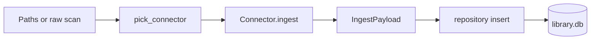
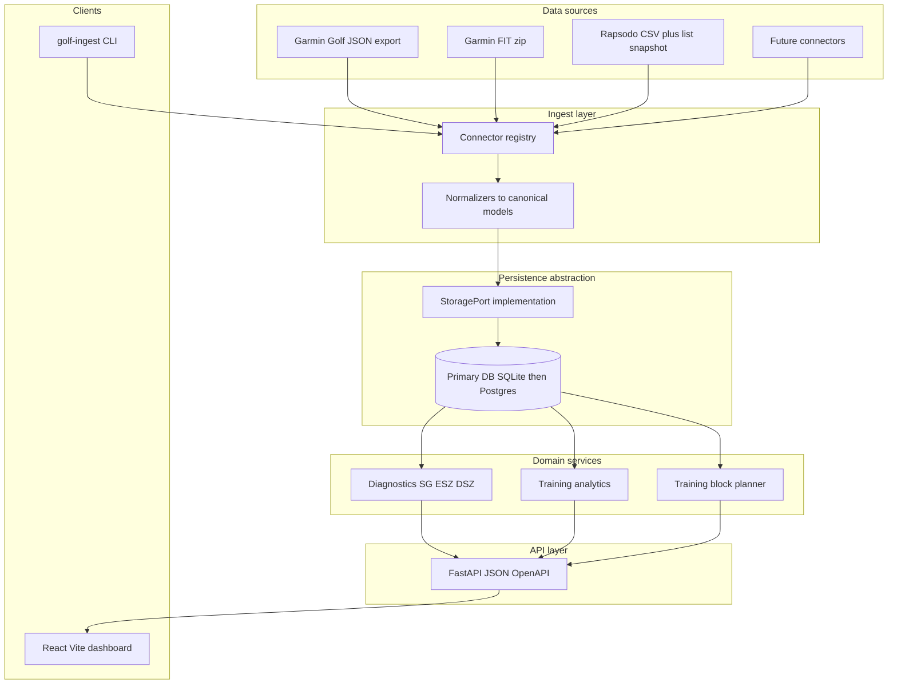

# Full system technical specification

This spec describes how the **golf-analysis** system works today, how it should evolve to meet your goals (**all analytical data in one database**, **modular connectors**, **swappable DB**, **FastAPI independent of the dashboard**), and how components interact end-to-end.

**Companion:** [Dashboard plan (NBLM-aligned)](../frameworks/dashboard-plan-nblm.md).

---

## 1. Goals (requirements traceability)

| Requirement | Spec response |
|---------------|---------------|
| Single source of truth for analytics | **Normalized relational tables** for rounds, holes, shots, range sessions/shots; raw files remain **archive + dedupe key** only. |
| Garmin JSON in SQL, not only file reads | Extend ingest + schema so **scorecard-level and shot-level** GC data live in queryable tables; APIs **do not** depend on reading `golf-export.json` at request time. |
| Modular connectors | Stable **`Connector` contract** ([`golf_analysis/connectors/base.py`](../../golf_analysis/connectors/base.py)), **registry** injection, optional **manifest** (id, version, file patterns) for future “Connectors” UI tab. |
| DB can change later | **`StoragePort` / repository abstraction** over concrete SQL today (SQLite); no SQL in route handlers. |
| API independent of UI | **FastAPI** serves **JSON + OpenAPI** only; **CORS** configurable; dashboard is a **separate build** (static files or separate origin). |
| Hosted later | Stateless API + external DB URL + object storage optional; same OpenAPI contract for local and cloud. |

---

## 2. Current system (as-built)

### 2.1 Runtime and packaging

- **Python 3.11+**, package [`golf_analysis`](../../golf_analysis/), CLI [`golf-ingest`](../../golf_analysis/cli.py) ([`pyproject.toml`](../../pyproject.toml)).
- **SQLite** default library `data/library.db`; schema documented in [SQLite library schema](../sqlite-library-schema.md); schema code in [`init_schema`](../../golf_analysis/repository.py).

### 2.2 Ingest pipeline (modular today, extend in place)

- **Entry**: [`ingest_paths`](../../golf_analysis/ingest.py) resolves connector via [`pick_connector`](../../golf_analysis/connectors/base.py) from [`default_connectors`](../../golf_analysis/connectors/base.py): **Rapsodo CSV**, **Garmin FIT**, **Garmin Golf Community JSON**.
- **Dedup**: one [`imports`](../../golf_analysis/repository.py) row per **`content_sha256`** of the **whole file**; duplicate bytes skip ingest.
- **Write path**: [`write_payload`](../../golf_analysis/repository.py) inserts `range_sessions` / `range_shots` and/or `golf_rounds` / `round_holes` / `round_track_points`.

### 2.3 What is actually stored (important gap)

**Rapsodo** — already **first-class relational**: `range_sessions`, `range_shots` (see [schema doc](../sqlite-library-schema.md)); session metadata augmented from `rapsodo_session_list.json` via [`rapsodo_list_kinds`](../../golf_analysis/rapsodo_list_kinds.py) at ingest.

**Garmin Golf Community JSON** (`golf-export.json`) — **partially** relational:

- `golf_rounds` + `round_holes` are populated from scorecards in `details` (see [`parse_garmin_golf_export`](../../golf_analysis/connectors/garmin_golf_community.py)).
- **Per-round shot traces** from global `shotDetails[]` are **not** normalized into their own table. They are attached per round inside **`golf_rounds.extra_json`** under **`garmin_golf_shot_details`** (see [schema doc §4.1](../sqlite-library-schema.md)).
- **`last10Data*`** blocks (approach/chip samples, stats) are **not** ingested into SQL today; several reports read the **JSON file directly** (e.g. [`analysis_plan_report.py`](../../golf_analysis/analysis_plan_report.py), [`executive_reveal_report.py`](../../golf_analysis/executive_reveal_report.py)).

**Garmin FIT** — rounds, holes, track points in SQL; no Golf Community `shotDetails` structure.

### 2.4 Reporting / deck code paths today

- **SQLite-first**: range cohort SQL ([`range_analysis.py`](../../golf_analysis/range_analysis.py)), dispersion in [`analysis_plan_report.py`](../../golf_analysis/analysis_plan_report.py).
- **JSON file alongside DB**: Garmin aggregates and last-10 SG still tied to **path to `golf-export.json`**.

This split is what you want to **eliminate** for the dashboard and NBLM pipeline: **APIs read DB (+ small config), not the raw export**, except optionally for **debug / re-parse** admin routes.

---

## 3. Target architecture (logical)

---

## 4. Data model evolution (single place for analytics)

### 4.1 Principles

- **Canonical entities**: `Player` (optional v1), `Import`, `Round`, `Hole`, `Shot`, `RangeSession`, `RangeShot`, `ConnectorRun` / `SyncState` (future).
- **Vendor payloads**: keep **minimal** JSON blobs (debug, fields not yet mapped) on parent rows; **do not** rely on blobs for dashboard queries.
- **External IDs**: store Garmin `scorecard_id`, shot `id`, Rapsodo session id on rows for idempotent upserts when re-ingesting the same export.

### 4.2 New / expanded tables (Garmin Golf Community)

| Table / change | Purpose |
|----------------|---------|
| **`round_shots`** (or `on_course_shots`) | One row per tracked shot: `round_id`, `hole_number`, `shot_order`, `garmin_shot_id`, `shot_type`, `meters`, `start_lat`, `start_lon`, `end_lat`, `end_lon`, `lie_start`, `lie_end`, optional `strokes_gained` when present. Enables ESZ/DSZ and pillar proxies **without** JSON file reads. |
| **`garmin_export_snapshots`** (optional) | One row per ingested file: `import_id`, `schema_version`, hashes of `last10Data*` JSON for reproducibility; or store **normalized** last-ten rows in **`lm_sample_shots`** with `source=garmin_last10`. |
| **`round_holes` enrichment** | Promote pin lat/lon, fairway outcome string, etc. from hole `extra_json` into columns when stable. |

**Migration strategy**: additive migrations in [`repository.py`](../../golf_analysis/repository.py) (PRAGMA + `ALTER TABLE`) or a thin migration module; backfill from existing `extra_json.garmin_golf_shot_details` on next ingest or one-off migration command.

### 4.3 Database portability (“can change if necessary”)

- Introduce a **`StoragePort`** (Protocol) used by services: `get_rounds(...)`, `get_round_shots(...)`, `get_range_shots(...)`, `upsert_import(...)`.
- **v1 implementation**: SQLite via existing `sqlite3` + repository functions.
- **v2**: Postgres (or Cloud SQL) with same Protocol; connection string from env `DATABASE_URL`.
- **Rule**: FastAPI and CLI call **only** `StoragePort` + pure functions for analytics, not raw `sqlite3` in routers.

ORM (**SQLAlchemy 2**) is optional; add when query complexity or migrations justify it. Until then, keep SQL in a **`sql/`** or **`storage/queries.py`** module per backend.

---

## 5. Connector modularity (easy to add; future UI tab)

### 5.1 Current contract (keep)

- [`Connector`](../../golf_analysis/connectors/base.py): `id`, `can_handle(path)`, `ingest(path) -> IngestPayload`.
- [`default_connectors()`](../../golf_analysis/connectors/base.py): ordered list; first match wins.

### 5.2 Extensions

| Mechanism | Purpose |
|-----------|---------|
| **Explicit registry** | e.g. `CONNECTORS: list[Connector] = [...]` loaded from config or entry points (`importlib.metadata` entry points `"golf_analysis.connectors"`) so third-party packages can register without editing core. |
| **Connector metadata** | Small dataclass: `id`, `label`, `description`, `file_globs[]`, `requires_secrets[]` for a future **Connectors** settings tab. |
| **Dry-run / validate** | `connector.validate_config()` for cloud credentials before sync. |

### 5.3 Future “Connectors” UI tab (non-blocking)

- **GET** `/api/connectors` — list registered ids + metadata + last sync status (from `imports` or `connector_state` table).
- **POST** `/api/connectors/{id}/sync` — trigger server-side job (queue or inline); secrets from server env or encrypted store, **never returned**.

---

## 6. FastAPI service (independent of dashboard)

### 6.1 Responsibilities

- **JSON only** (versioned under `/api/v1/...`).
- **OpenAPI** at `/api/openapi.json` and `/docs` (optional disable in prod).
- **CORS**: `ALLOW_ORIGINS` env (comma list); local dev includes `http://localhost:5173` for Vite.
- **Auth** (later): API key or JWT for hosted mode; local mode can skip.
- **No embedded dashboard build** in the same process as requirement for modularity; optionally `StaticFiles` for **staging** only.

### 6.2 Example route groups (align with [dashboard-plan-nblm](../frameworks/dashboard-plan-nblm.md))

- `GET /api/v1/settings` / `PUT` — windows, benchmark handicap, `sessions_in_block`.
- `GET /api/v1/strategy/aggregates`, `GET /api/v1/strategy/scorecards` — from **DB** after normalization.
- `GET /api/v1/performance/pillars`, `GET /api/v1/performance/rounds/{id}`.
- `GET /api/v1/training/clubs`, `GET /api/v1/training/sessions`, `GET /api/v1/training/scatter`.
- `GET /api/v1/plans/current` — insights + training block JSON.

### 6.3 Deployment shapes

| Shape | Description |
|-------|-------------|
| **Local dev** | `uvicorn` API + `vite dev` dashboard; Vite proxies `/api` to FastAPI. |
| **Single host** | API + nginx serving **static** `dashboard/dist`; same domain avoids CORS. |
| **Split host** | API on `api.example.com`, SPA on `app.example.com`; CORS + HTTPS. |

---

## 7. Dashboard (client) boundaries

- **React + Vite + TypeScript** (per UI stack choice): consumes **only** OpenAPI contract; no direct file system access.
- **Build artifact**: static `index.html` + JS/CSS; environment variable `VITE_API_BASE_URL` for API root.
- **Versioning**: dashboard `package.json` version + API `/api/v1` so client and server can ship independently.

---

## 8. Sync and secrets (hosted-ready)

- **Secrets**: environment variables or managed secret store in cloud; dashboard **Settings** POSTs tokens to API which **writes** server-side and responds `{ configured: true }` **without echoing** values (see [dashboard plan](../frameworks/dashboard-plan-nblm.md)).
- **Sync jobs**: optional `POST /api/v1/jobs/ingest` that runs the same [`ingest_paths`](../../golf_analysis/ingest.py) code path with allowed roots (avoid arbitrary path injection).

---

## 9. Implementation phases (recommended order)

1. **Schema + ingest**: Add `round_shots` (and optional Garmin snapshot / last-ten tables); extend [`GarminGolfCommunityConnector`](../../golf_analysis/connectors/garmin_golf_community.py) / writer to populate them; backfill from `extra_json`.
2. **Refactor readers**: Move [`analysis_plan_report`](../../golf_analysis/analysis_plan_report.py) Garmin sections to **DB queries**; keep JSON ingest as **write** path only.
3. **`StoragePort`**: Wrap repository; migrate CLI/report code behind it.
4. **FastAPI**: New package e.g. `golf_analysis/api/` with routers calling services + `StoragePort`.
5. **Dashboard**: Scaffold Vite app; wire to OpenAPI; implement tabs per [dashboard-plan-nblm](../frameworks/dashboard-plan-nblm.md).
6. **Postgres** (optional): second `StoragePort` impl + `DATABASE_URL`.

---

## 10. Implementation checklist

Track engineering progress against this spec:

- [ ] Add `round_shots` (+ optional `garmin_last10` / sample tables); migrate repository write + backfill from `extra_json`.
- [ ] Extend Garmin Golf Community ingest to populate new tables; dedupe on Garmin ids.
- [ ] Introduce `StoragePort`; move analytics queries off direct JSON reads.
- [x] Add `golf_analysis/api` FastAPI app, CORS, OpenAPI v1 routes (SQLite-backed; `StoragePort` still to do).
- [x] Scaffold `dashboard/` (Vite + TS); proxy `/api` in dev; optional `VITE_API_BASE_URL` for split hosting.
- [ ] Optional: Postgres `StoragePort` + `DATABASE_URL`.

---

## 11. Canonical copy

This file under **`docs/architecture/`** is the **canonical** full-system tech spec for the repository. Update it when schema or deployment assumptions change.

### Implemented (v1 dashboard slice)

- **API:** `uv run golf-ingest dashboard-api` → FastAPI app in [`golf_analysis/api/main.py`](../../golf_analysis/api/main.py) (`/api/v1/*`). See [`tests/test_api_dashboard.py`](../../tests/test_api_dashboard.py).
- **UI:** [`dashboard/`](../../dashboard/) — Vite + React + Recharts; run `npm install` and `npm run dev` (see [`dashboard/README.md`](../../dashboard/README.md)).
