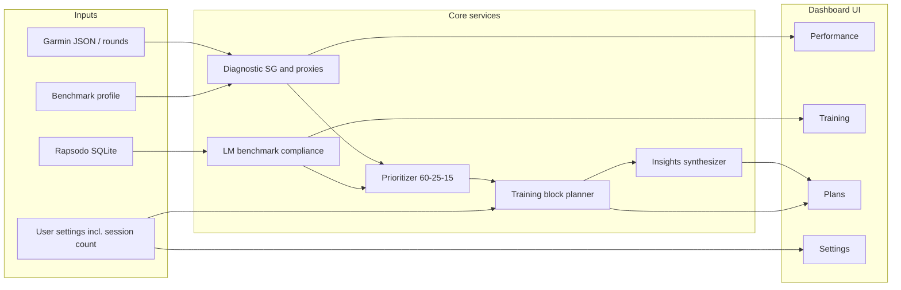

# Dashboard plan (NBLM-aligned)

This document turns the [best-practice framework (NBLM)](./best-practice-framework-nblm.md) into a concrete **product plan**: dashboard components, user flow, and how the app produces **key improvement insights** plus a **configurable training block** (default 3–4 sessions).

Related context: [Full system tech spec](../architecture/full-system-tech-spec.md) (architecture, data model, API/UI split), [scoring-method.md](./scoring-method.md), [strokes-gained.md](./strokes-gained.md), [rapsado-metrics.md](./rapsado-metrics.md), [on-course analysis methodology](../on-course-analysis-methodology.md).

---

## 1. What the framework asks the product to do

| Framework layer | Role in the product |
|-----------------|---------------------|
| **§1 Diagnostic engine** | Turn on-course data into **where** you leak vs a **handicap benchmark**, split into **OTT / APP / ARG / PUTT**. |
| **Root-cause bridge** | When a pillar is weak, point to **launch-monitor metrics** (smash, spin, spin axis, AoA, etc.) that explain *symptom → mechanism*. |
| **§2 Prioritization** | Rank work: **Priority 1 (~60%)** worst SG, **2 (~25%)** maintenance, **3 (~15%)** scoring zone / putting fine-tune. |
| **§3 Session design** | Each session has **structure** (ball/time cap), **drill type** (distance game, direction game, Combine for P3), **immediate metric feedback** (LM + dashboard as the stand-in for vendor-specific AI coaching). |
| **§4 Strategy / env** | Optional later: DECADE-style targets, wind / plays-like (needs extra data sources). |

The dashboard **operationalizes** this loop with **Garmin** + **Rapsodo** (and optional third-party SG later). It does not require Uneekor GOATY, Clippd, or Tagmarshal to ship v1.

---

## 2. Dashboard components

### A. Data and settings (foundation)

- Paths / sync for **Garmin export** and **SQLite library** (Rapsodo and other LM CSVs).
- **Benchmark**: target handicap (or index) driving *expected* SG or **proxy stats** per pillar until a full SG baseline table exists in-repo.
- **Training block**: `sessions_in_block` (default **4**, minimum **3**, user-configurable).
- **Optional**: time allocation weights (default **60 / 25 / 15** from the framework).
- **Secrets** (sync tokens): stored server-side or in a local secrets file; **never echoed** in the UI (masked, write-only fields).

### B. Diagnostic engine (UI: Performance + part of Strategy)

- **Pillar view**: OTT, APP, ARG, PUTT vs benchmark → **delta** and **rank**.
- **Trend**: rolling N rounds or date window (from settings): is Priority 1 improving or regressing?
- **On-course geometry** (Scoring Method + methodology docs): ESZ / DSZ / penalties / putts as **supporting tiles** so strategy and SG tell one coherent story.

### C. Mechanical diagnosis (UI: Training + detail panes)

- Framework table: weakness area → diagnosis → **LM metrics** (see NBLM §1).
- **Club-level Rapsodo** (and future LMs): carry, offline, smash, spin, launch, path, etc., vs **optimal windows** (e.g. driver / 7i / PW bands in the framework).
- States: **in window**, **out of window**, **insufficient sample**.

### D. Prioritization engine (server module; drives Plans)

- **Inputs**: pillar deltas, LM compliance flags, optional ESZ/DSZ gaps.
- **Outputs**: **Priority 1 / 2 / 3** labels + recommended **time share** for the next block (default 60 / 25 / 15).
- **Rules (v1)**:
  - **P1** = largest negative SG (or worst defensible proxy).
  - **P2** = pillars near benchmark (maintenance).
  - **P3** = short game / 100-yard zone and putting when P1 is primarily full-swing ball striking.

### E. Training block planner (core deliverable generator)

- **Inputs**: priorities, `sessions_in_block`, flagged clubs / metrics.
- **Outputs**: ordered **session** objects, each with:
  - **Theme** (P1 fix vs P2 maintenance vs P3 scoring / Combine).
  - **Drill protocol** from NBLM §3: *Distance game*, *Direction game*, *Rapsodo Combine* (for P3 / gapping).
  - **Volume**: cap **~50 balls or ~45 minutes** per framework.
  - **Exit / success rule**: stability on measurable LM stats (dispersion, combine-style score when available). *Dynamic Swing Score / Uneekor AI* remains a **placeholder** until that data exists.

### F. Insights layer (what the user reads first)

- **Top 3 improvement lines**: pillar + one-line “why” + one **measurable** focus (e.g. direction game until offline vs carry ratio improves).
- **Data confidence**: label thin data (e.g. Garmin last-10 SG samples vs full-round SG).

---

## 3. User journey

1. **Settings** — Set benchmark, round/practice window, `sessions_in_block`, refresh data, secrets for sync.
2. **Performance** — Four pillars vs benchmark; one headline (“Biggest leak: …”).
3. **Training** — Drill into a pillar → clubs and LM metrics vs optimal windows.
4. **Plans** — **Key insights** card + **Training block** (Session 1…N) with drill names, targets, ball/time budget, P1/P2/P3 tag.
5. **Execute** — User runs sessions on range (future: log session outcomes back into the app).
6. **Refresh** — Recompute diagnostics; when P1 stabilizes, **pivot** next block (framework §2).

---

## 4. Default mapping: §3 drills → sessions in the block

With **four sessions**, aligned to NBLM:

| Session | Framework slot | Typical content |
|--------|----------------|-----------------|
| **1** | Priority 1 (~60%) | **Distance game** — random targets, club changes; ties to worst distance / dispatch pillar (often APP or OTT). |
| **2** | Priority 1 (continuation) | **Direction game** — offline window; spin-axis / face-to-path cue if slice/hook pattern in LM. |
| **3** | Priority 2 (~25%) | **Maintenance** — short game or neutral pillar; fewer balls, quality reps. |
| **4** | Priority 3 (~15%) | **Rapsodo Combine** or 100-yard + two-putt style scoring work when data supports it. |

If `sessions_in_block = 3`, merge sessions **3+4** (shorter maintenance + one scoring session) or drop the lowest-impact session with an explicit note in the UI.

---

## 5. Architecture (conceptual)

---

## 6. Final deliverables (product contract)

| Deliverable | Definition |
|-------------|------------|
| **Key insights** | Ranked **pillar gaps** plus **one to three root-cause metric lines** per gap (NBLM table + LM data). |
| **Training block** | **`sessions_in_block`** (default 3–4, **configurable**) sessions, each tagged **P1 / P2 / P3**, with **named §3 protocols**, **ball/time cap**, and **measurable exit criteria** using data the repo actually stores today (dispersion, combine score when present, optimal windows). |

---

## 7. Known gaps vs the full framework (evolution)

| Framework element | v1 plan |
|-------------------|--------|
| Uneekor **Dynamic Swing Score**, GOATY voice | Placeholder exit rule; use **Rapsodo** dispersion / combine-style metrics first. |
| bebrassie / Clippd **full SG** | Use Garmin **samples + proxies** until an in-repo **SG baseline** exists. |
| DECADE, WindTag, Golf Pad **plays like** | Optional **Strategy+** phase; not required for v1 insights + training block. |

---

## 8. Implementation checklist (engineering)

- [ ] Pillar model + benchmark config in settings store.
- [x] Garmin: scorecard-derived **Scoring Method proxies** + round rollups (`garmin_export_analytics` + strategy/performance routes).
- [ ] Garmin: optional ESZ/DSZ from shot geometry (methodology doc).
- [x] Rapsodo: club aggregates + carry p10/p90, gapping, landing side, shot list, shape proxy (`range_shot_analytics` + training routes).
- [ ] Rapsodo: optimal-window checks (framework + [rapsado-metrics.md](./rapsado-metrics.md)).
- [ ] Prioritizer + training block template engine (`sessions_in_block`).
- [x] Plans API returning `{ insights[], sessions[] }` (initial).
- [x] Dashboard UI tabs: Strategy, Performance, Training, Plans, Settings; data wired to routes above.

When this checklist is complete, the dashboard matches this plan end-to-end for the NBLM-aligned loop.

---

## 9. Tab ↔ data source matrix (v1, from repo data)

Reference screenshots: `tmp/screenshots/` (PNG captures; gitignored; IDE/workspace search may not index binaries—use Finder or `ls` to confirm). Use them for Garmin Connect / Rapsodo Session Insights parity.

| User-facing area (from `docs/feature-list.md`) | Strategy | Performance | Training |
|-------------------------------------------------|----------|-------------|----------|
| **The Scoring Method** — ESZ / DSZ story, penalties, blow-ups, tee-line proxy, putting load | **Yes** — `GET /api/v1/strategy/overview` → `scoring_method` (proxies + caveats; true ESZ/DSZ need shot geometry per [scoring-method.md](./scoring-method.md)) | Supporting context in Garmin SG | Practice card tie-in via Training insights (future) |
| Garmin rounds overview, scorecard list / drill-down rows | **Yes** — `scorecards[]` from export (year filter) | **Yes** — same export via `garmin-bundle` rollups | — |
| Par / birdie / bogey breakdown, GIR, up-down | Not in export v1 (hole `par` often missing in community JSON) | Partial — use library `rounds` where normalized | — |
| Fairways, penalties, putts | Proxies in `scoring_method` | Rollups + last-10 SG samples | — |
| SG vs similar handicap (last-10 samples) | — | **Yes** — `last10` in `GET /api/v1/performance/garmin-bundle` | — |
| Course / window stats (mean strokes, best, score types) | Short summary from `performance` in overview (optional) | **Yes** — `round_rollups` in `garmin-bundle` + `GET /api/v1/rounds/summary` | — |
| Shot maps, per-course trouble holes | Planned (needs `round_shots` / geometry) | Planned | — |
| Rapsodo shot list with stats | — | — | **Yes** — `GET /api/v1/training/shots` |
| Dispersion / carry distribution (p10–p90), dispersion index | — | — | **Yes** — `GET /api/v1/training/analytics` → `carry_distribution` |
| Club gapping | — | — | **Yes** — `gapping` |
| Landing side (L / straight / R) | — | — | **Yes** — `landing_side` |
| Shot shape frequency | — | — | **Yes** — `shot_shape`: offline three-way + **spin-axis five-way** (hook/draw/straight/fade/slice) when ≥15 axis samples |
| Club comparison / multi-club overlays | — | — | **Yes** — `GET /api/v1/training/club-compare` (two clubs: lateral %, mean carry by miss, launch/smash) + scatter |
| Key takeaways | — | — | **Yes** — `takeaways[]` on `GET /api/v1/training/analytics` + first lines on `GET /api/v1/plans/training-block` |
| Dispersion vs handicap band | — | — | Needs benchmark config (planned) |

### Implemented API routes (dashboard)

- `GET /api/v1/strategy/overview` — Garmin JSON + scoring-method proxies + scorecards.
- `GET /api/v1/performance/garmin-bundle` — round rollups + last-10 SG for the year.
- `GET /api/v1/training/analytics` — carry distribution, landing side, gapping, shot-shape (offline + spin-axis five-way), **takeaways**.
- `GET /api/v1/training/club-compare` — two-club Session Insights–style table.
- `GET /api/v1/training/shots` — recent shots for drill-down.

Existing: `GET /api/v1/training/clubs`, `scatter`, `sessions`; `GET /api/v1/performance/garmin-samples`; `GET /api/v1/rounds`, `rounds/summary`.
