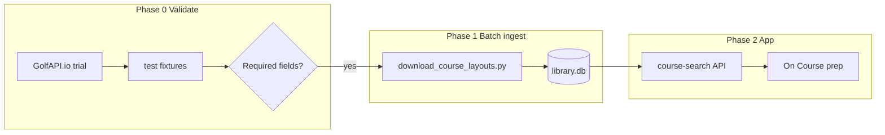

# New course preparation plan

**Status: PARTIAL** — manual course prep shipped (Woldingham White); GolfAPI batch ingest still **PAUSED** pending API key ([contact / sign up](https://www.golfapi.io/)).

**Last updated:** 2026-05-26

## What's already shipped (On Course v1)

These are live in the app today; this plan builds on top of them:

- Home → **On Course** / **Coach Analysis** split
- On Course tabs: Swing, Yards, Pitch, Chip, Fix, Wind, **Course**
- User **playbook** (editable in Coach → Settings) → `on_course_playbook.json`
- **Course tab** with personal history: attack/caution holes + `top_improvement` from Garmin rounds
- **New course prep (manual):** Woldingham White scorecard in `golf_analysis/course_layout/manual_courses.py`; hole plans via `GET /api/v1/on-course/prep/{slug}`; On Course → Course tab → **Prepare for**
- Cloud deploy: see [deploy-google-cloud.md](deploy-google-cloud.md)

## Resume checklist

When you have the API key:

1. Set `GOLF_COURSE_API_KEY` in local `.env` (never commit)
2. Run Phase 0 spike (`scripts/spike_golfapi.py` — not built yet)
3. Confirm validation checklist below (especially **yardage per hole per tee**)
4. Continue with Phase 1 batch ingest → `library.db`
5. Tell the agent: *"resume new course prep plan from docs/new-course-prep-plan.md"*

---

## Goal

Help prepare for a **new course** (never played before) by combining:

- **Course layout** (par, stroke index, yardages) from a third-party catalog
- **Personal game profile** (WHERE to improve — penalties, ESZ, dispersion — not swing fixes)
- **User playbook** (your own swing/chip thoughts)

Phone reads from **SQLite** after sync — no live API calls on course.

---

## Priority order

1. **Phase 0** — Validate [GolfAPI.io](https://www.golfapi.io/) returns required fields
2. **Phase 1** — Batch download UK courses into `library.db`
3. **Phase 2** — Course search API + hole planner + Prepare UI

Garmin `courseSnapshots` index is a **later supplement** (courses already in export).



---

## Validation checklist (Phase 0)

Provider passes only if one course fetch returns **all** of:

| Field | Required |
|-------|----------|
| Club / course name | Yes |
| Tee name(s) | Yes |
| 18 (or 9) holes | Yes |
| Par per hole | Yes |
| Stroke index per hole | Yes |
| **Yardage per hole per tee** | Yes |
| Slope / rating | Optional v1 |

Test courses: one from Garmin history (e.g. Worthing Golf Club) + one new to you.

**Deliverables:** spike script, fixtures in `tests/fixtures/golfapi/`, pass/fail note.

**Stop gate:** If yardages missing → try alternate provider before batch download.

---

## Provider

- **Primary:** GolfAPI.io — [API docs](https://documenter.getpostman.com/view/1756312/UVeDsT2b)
- **Auth:** `GOLF_COURSE_API_KEY` env var
- **Not validated yet** in this repo

---

## SQLite schema (Phase 1)

Store in existing `library.db` ([`golf_analysis/repository.py`](../golf_analysis/repository.py)) — sync via existing `push-dashboard-data.sh`.

```sql
course_clubs (
  id INTEGER PRIMARY KEY,
  provider TEXT NOT NULL,
  external_id TEXT NOT NULL,
  name TEXT, city TEXT, country TEXT,
  lat REAL, lng REAL,
  fetched_at TEXT,
  UNIQUE(provider, external_id)
)

course_layouts (
  id INTEGER PRIMARY KEY,
  club_id INTEGER REFERENCES course_clubs(id),
  external_id TEXT,
  name TEXT,
  hole_count INTEGER,
  par_total INTEGER,
  UNIQUE(provider, external_id)
)

course_tees (
  id INTEGER PRIMARY KEY,
  layout_id INTEGER REFERENCES course_layouts(id),
  name TEXT,
  slope REAL, rating REAL,
  gender TEXT,
  UNIQUE(layout_id, name, gender)
)

course_holes (
  layout_id INTEGER,
  tee_id INTEGER,
  hole_number INTEGER,
  par INTEGER,
  stroke_index INTEGER,
  yardage_yards INTEGER,
  PRIMARY KEY (tee_id, hole_number)
)
```

---

## Implementation todos

| ID | Task | Status |
|----|------|--------|
| golfapi-validation-spike | Spike GolfAPI: search + fetch 2–3 UK clubs; fixtures | **Blocked on API key** |
| golfapi-client-normalize | `golf_analysis/course_layout/golfapi_client.py` | Pending |
| sqlite-course-schema | Add tables to `init_schema` | Pending |
| batch-download-script | `scripts/download_course_layouts.py` | Pending |
| cloud-sync-library-db | Verify enlarged `library.db` push | Pending |
| course-search-api | Search/layout endpoints from SQLite | Pending |
| game-profile-api | Personal WHERE profile for pre-round | Pending |
| hole-planner | `on_course_prep.py` | **Done** (manual courses) |
| prepare-ui | On Course → Course tab prep section | **Done** (manual courses) |
| manual-course-catalog | `course_layout/manual_courses.py` | **Done** (Woldingham White) |
| garmin-snapshot-index | Index export snapshots; link to catalog | Later |

---

## Design principles

- **System = WHERE** (tee strategy, lay-ups, target scores) — not swing coaching
- **Playbook = WHAT** (user-edited technique crib sheet)
- **Batch once, read offline** on phone via Cloud Run + GCS

---

## Related files (when built)

- `golf_analysis/course_layout/golfapi_client.py`
- `golf_analysis/course_layout/store.py`
- `golf_analysis/on_course_prep.py`
- `scripts/spike_golfapi.py`
- `scripts/download_course_layouts.py`
- `tests/test_golfapi_integration.py`
